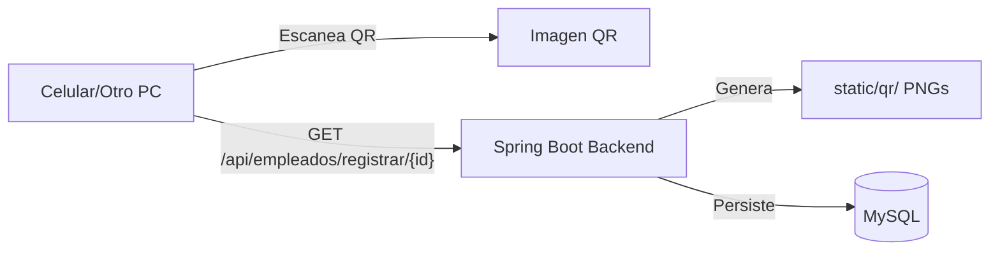

# Requirements & Design

### Overview & Goals
El objetivo es garantizar que la funcionalidad de códigos QR sea robusta, accesible desde otros dispositivos y que los datos codificados sean coherentes con la configuración del servidor, corrigiendo errores de CORS, falta de regeneración de QRs y proporcionando un punto de registro real.

### Scope
- **In Scope**:
    - Configuración de red local con la IP detectada (`192.168.1.7`).
    - Corrección de CORS en el backend para permitir acceso externo.
    - Implementación de regeneración de QRs en actualizaciones de empleados.
    - Creación de endpoint de registro de asistencia y actualización del escáner.
- **Out of Scope**:
    - Configuración de dominios públicos (.com) o despliegue en la nube.

### Functional Requirements
- Los códigos QR deben regenerarse automáticamente si se actualiza la información de un empleado.
- El backend debe permitir peticiones desde cualquier dispositivo de la red local (CORS).
- El escáner debe realizar una petición real al backend para registrar la asistencia.
- El frontend debe ser accesible mediante `http://192.168.1.7`.

### Technical Design

#### 1. Corrección de CORS
Actualmente `CorsConfig.java` restringe orígenes a `localhost`. Se ampliará para permitir el acceso desde la red local.

#### 2. Ciclo de Vida del QR
- **Generación en Actualización**: Modificar `EmpleadoController.java` para que el método `actualizar` invoque a `qrGeneratorService`.
- **Regeneración Masiva**: Añadir un endpoint para actualizar todos los QRs existentes con la IP configurada.

#### 3. Registro de Asistencia (Mínimo Viable)
- **Backend**: Endpoint `GET /api/empleados/registrar/{id}` que simule el éxito del registro.
- **Frontend**: En `Scanner.jsx`, extraer el ID y llamar al backend con `axios`.

### File Structure
- `src/main/java/.../CorsConfig.java`: Ajuste de `allowedOriginPatterns`.
- `src/main/java/.../controller/EmpleadoController.java`: Nuevos endpoints y lógica de regeneración.
- `frontend-asistencia/src/Components/Scanner.jsx`: Integración con API.
- `docker-compose.yml`: Ajuste de `APP_QR_BASE_URL`.

### Architecture Diagram


# Guía de Acceso Externo (Red Local e Internet)

Para que tu página funcione en cualquier dispositivo, sigue estos pasos:

### 1. Configuración Automática (IP Local)
Hemos detectado que la IP de tu PC es `192.168.1.7`. Vamos a configurar el sistema para que use esta dirección.

- **Cambio en `docker-compose.yml`**:
  ```yaml
  - APP_QR_BASE_URL=http://192.168.1.7:8080
  ```

### 2. Abrir el Firewall (Comando Rápido)
Ejecuta esto en una terminal de PowerShell como Administrador para permitir que otros dispositivos entren:
```powershell
New-NetFirewallRule -DisplayName "Acceso Docker Asistencia" -Direction Inbound -LocalPort 80,8080 -Protocol TCP -Action Allow
```

### 3. Acceder desde otro dispositivo en tu Wi-Fi
En tu celular o tablet, abre el navegador y entra a:
`http://192.168.1.7`

### 4. ¿Y si quiero entrar desde fuera de mi casa? (Internet)
Si quieres abrirlo desde cualquier lugar del mundo (sin estar en tu Wi-Fi):
1. Descarga [Ngrok](https://ngrok.com/).
2. Ejecuta: `ngrok http 80`.
3. Ngrok te dará una dirección pública (ej: `https://abcd-123.ngrok-free.app`).
4. Usa esa dirección en cualquier dispositivo.
   *Nota: Tendrías que actualizar `APP_QR_BASE_URL` con esa dirección de Ngrok si quieres que los QR también funcionen por internet.*

---

# Delivery Steps

###   Step 1: Corregir CORS y habilitar acceso externo en Docker
Asegurar que el sistema sea accesible y el backend responda a dispositivos externos.
- Modificar `CorsConfig.java` para permitir orígenes de la red local.
- Actualizar `APP_QR_BASE_URL` en `docker-compose.yml` con la IP `192.168.1.7`.
- Ejecutar comando de apertura de Firewall.

###   Step 2: Mejorar el ciclo de vida de los QRs y endpoint de registro
Garantizar que los QRs estén siempre actualizados y sean funcionales.
- Modificar `EmpleadoController.java` para regenerar QR al actualizar empleado.
- Implementar endpoint de regeneración masiva y endpoint de registro de asistencia.

###   Step 3: Conectar el Escáner del Frontend con el API
Hacer que el escaneo de QR realice una acción real en el sistema.
- Actualizar `Scanner.jsx` para realizar la petición `axios` al backend.
- Validar el flujo completo: Escaneo -> Petición Backend -> Confirmación en UI.